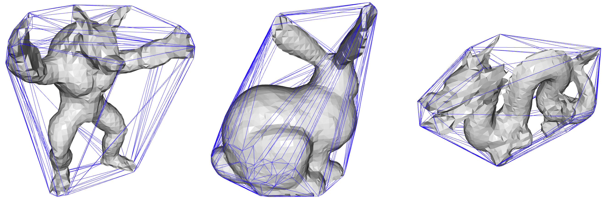
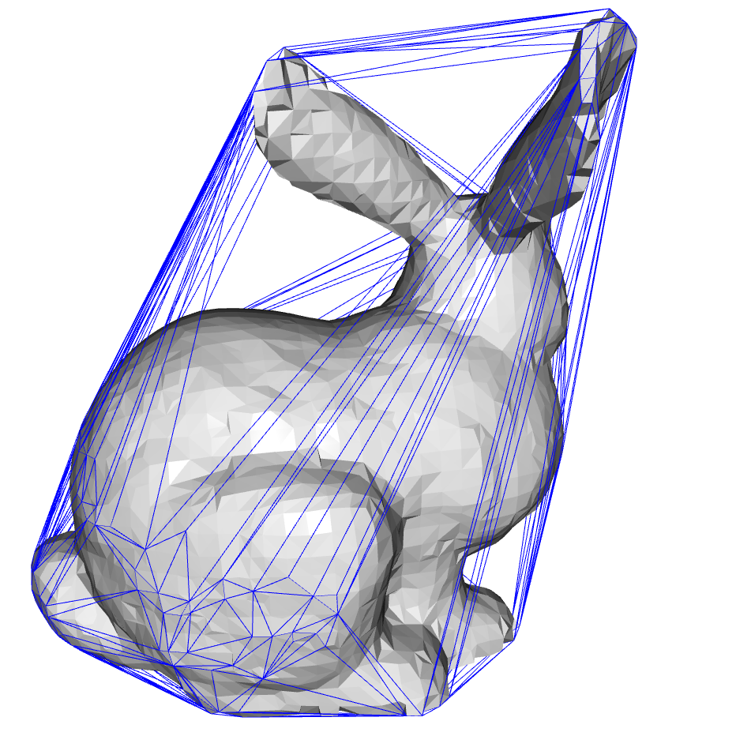
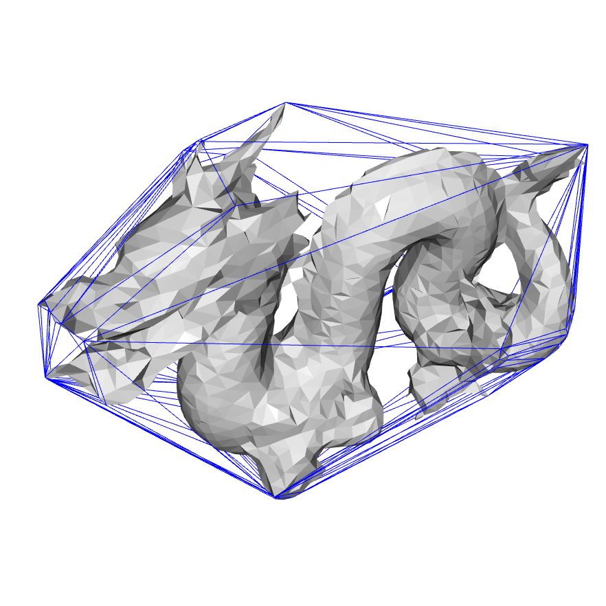
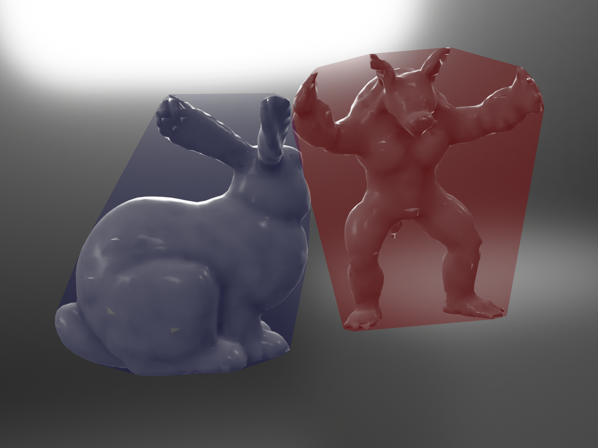
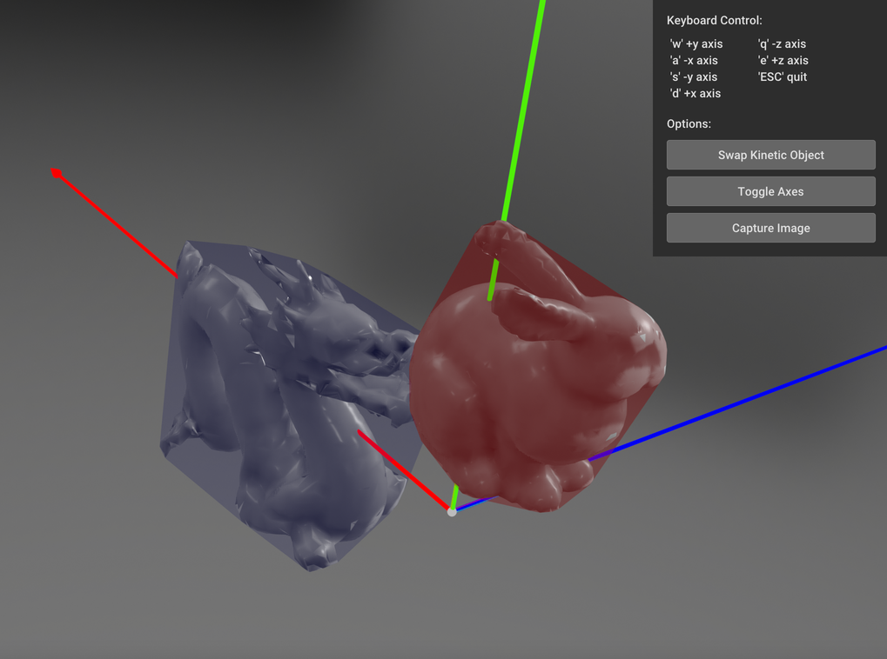

# Convex Hull 3D

My implementation of Incremental Convex Hull algorithm and Separating Axis Theomrem for 3D objects.

## Dependencies

- Python 3.7
- Open3D
- NumPy
- tqdm

## Usage


### Compute Convex Hull

- Script: convex_hull.py

- Usage:

  ```
  usage: convex_hull.py [-h] [--file FILE] [--save_path SAVE_PATH] [--perf_test] [--num_pts NUM_PTS] [--num_trials NUM_TRIALS] [--vis]

  Compute the convex hull of a 3D object.

  optional arguments:
    -h, --help            show this help message and exit
    --file FILE           The target model file.
    --save_path SAVE_PATH
                          The saving path of the result. (not supported in perf-
                          test mode)
    --perf_test           Enable perf-test mode
    --num_pts NUM_PTS     The number of generated points (perf-test mode only).
    --num_trials NUM_TRIALS
                          The number of trials (perf-test mode only).
    --vis                 Whether visualize the result? (only visualize the last
                          trial in perf-test mode)
  ```

- Example

  ```
  python convex_hull.py --file data/bunny_sim32.ply --vis
  ```

### Interactive SAT Visualizer


- Script: vis_collision.py

- Usage:

  ```
  usage: vis_collision.py [-h] -m1 M1 -ch1 CH1 -m2 M2 -ch2 CH2

  Visualize collision detection between convex hulls.

  optional arguments:
    -h, --help  show this help message and exit
    -m1 M1      The first mesh file.
    -ch1 CH1    The convex hull file of the first mesh.
    -m2 M2      The second mesh file.
    -ch2 CH2    The convex hull file of the second mesh.
  ```
- Note: it is recommended to input normalized models. (See: tools/normalize_mesh.py).

- Example:

  ```
  python vis_collision.py -m1 data/stanford_dragon_sim32_n.obj -ch1 out/stanford_dragon_convhull_n.obj -m2 data/bunny_sim32_n.ply -ch2 out/bunny_convhull_n.obj
  ```

### Mesh Normalization

- Script: tools/normalize_mesh.py

- Usage:
  ```
  usage: normalize_mesh.py [-h] --file FILE

  Normalize the input mesh's bounding box to [-1, 1] x [-1, 1] x [-1, 1].

  optional arguments:
    -h, --help   show this help message and exit
    --file FILE  The target model file.
  ```

- Note: this tool is useful for visualizing SAT collision detection when one model is far more enormous than another model. The output file will be placed in the same directory of the input, and has the same filename but with '_n' suffix, e.g., the output file for 'out/bunny.ply' is 'out/bunny_n.ply'.


## Demo








## References

- [3D Convex Hulls](http://www.bowdoin.edu/~ltoma/teaching/cs3250-CompGeom/spring17/Lectures/cg-hull3d.pdf)
- Dirk Gregorius. The Separating Axis Test between Convex Polyhedra. GDC 2013.
